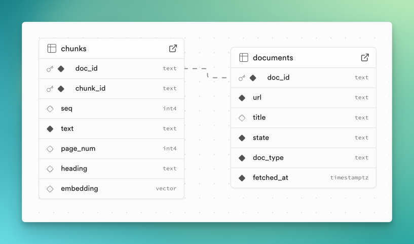

# Sambot — Proof of Concept

This is a small POC for Sambot: a RAG workflow over state program docs. It’s wired to a Supabase Postgres with pgvector that stores embeddings of web pages and PDFs. The crawl happened with Firecrawl in their Dashboard. Firecrawl returns a crawl/job ID, which is then used locally to fetch results, chunk them, embed with OpenAI, and upsert into Supabase.

The embedding/chunking is custom and kept simple on purpose for this demo. `ask.py` is a tiny playground that embeds a question, retrieves nearest chunks from pgvector, and asks a chat model to answer using those passages.

## Files

- `src/fetch_and_embed.py` — put the Firecrawl crawl ID here; fetches results, chunks, embeds, and upserts.
- `src/ask.py` — quick CLI to query the RAG (retrieve + answer with sources).
- `src/util.py` — helpers for DB (Supabase Postgres), Firecrawl session, chunking, and embeddings.
- `.env.example` — variables needed (`FIRECRAWL_API_KEY`, `OPENAI_API_KEY`, `SUPABASE_DB_URL`, etc.).

## Supabase Schema:
